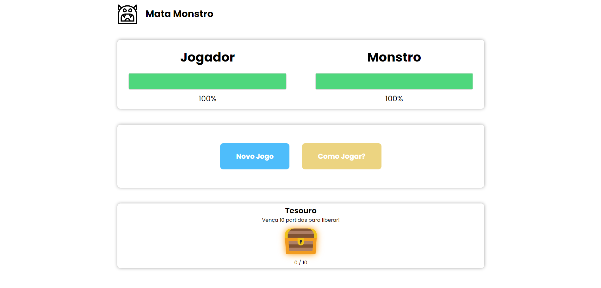

# Mata Monstro - Vue JS
`html, css, vue, local storage`  
Mata Monstro é um jogo de batalha em turnos, o objetivo principal <s>,como muito bem nomeado,</s> é MATAR O MONSTRO!! Para isso, ao iniciar o jogo serão exibidas as ações disponíveis para realizar a luta.  
O objetivo deste projeto é treinar os conceitos básicos de Vue JS.

## Tela Principal

## Tela Inicial
Há um tesouro pra quem vencer o desafio de atingir 10 vitórias!!

Este projeto é um exercício proposto no curso Vue JS - O Guia Completo (cod3r)
